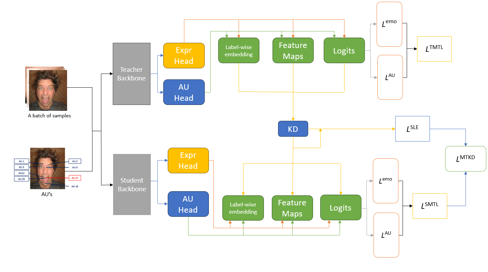
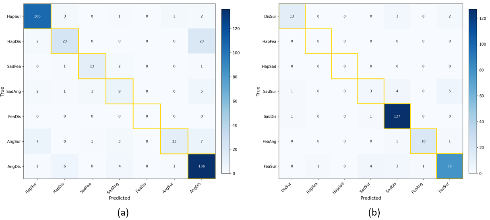
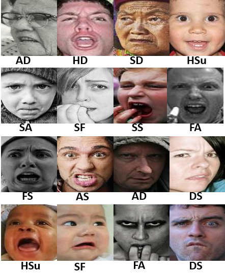
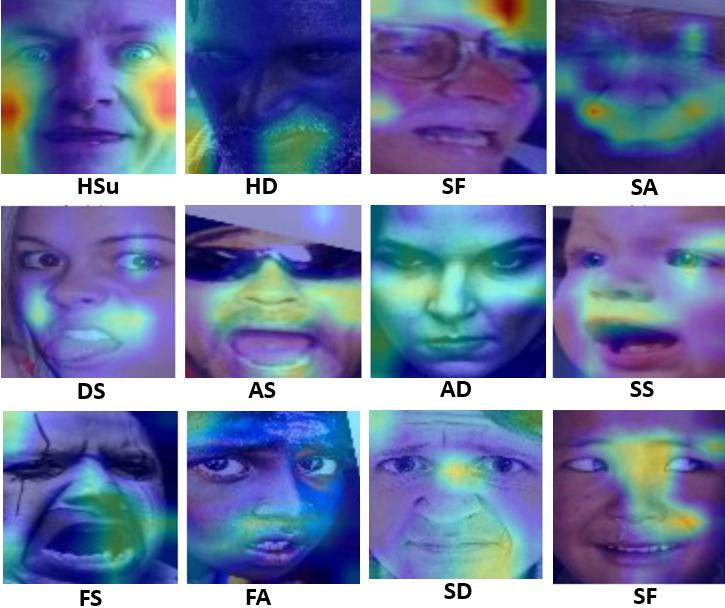

# CFER-MTKD
### Multi-Label Knowledge Distillation of Compound Expression using Multi-Task Learning

---

## Overview



**Figure:** The complete architecture of our proposed MTKD approach, showing Multi-Label Knowledge Distillation from the teacher to student network. This approach adopts Multi-Task Knowledge Distillation, which distills **feature-level**, **logit-level**, and **embedding-level** knowledge from the teacher.

---

## Getting Started

### Requirements
```bash
pip install -r requirements.txt
```

### Run
```bash
python3 main.py --cfg_file configs/rafml/rafml_resnet101_to_resnet34_l2d.py --data_root RAF-ML
```

---

## Results

### Confusion Plots — RAF-CE Dataset


### Sample Images — RAF-CE Dataset


### GradCAM Visualization


---

## Acknowledgement

We dedicate this work to **Bhagawan Sri Sathya Sai Baba** and express our sincere gratitude to our guide **Dr. Darshan Gera** for his invaluable support and guidance throughout this work.

---

## Contact

📧 [shivanshsharma5102003@gmail.com](mailto:shivanshsharma5102003@gmail.com)
